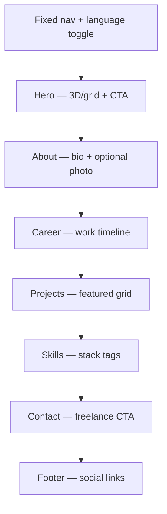

# Portfolio Design Spec

**Date:** 2026-05-21  
**Status:** Approved (brainstorming)  
**Project:** `/Users/fugizap/development/startup/portfolio`

## Goals

| Priority | Goal |
|----------|------|
| Primary | Personal brand — showcase identity and projects |
| Secondary | Freelance conversion — clear path for potential clients to contact |

## Profile

- **Role:** Front-end developer (React, interfaces, web apps)
- **Audience:** Recruiters, peers, and potential freelance clients (international)
- **Content readiness:** Partial — some projects and copy exist; photo and some details pending

## Approach

**Single-page cinematic** (Approach 1) on existing stack: React 19 + TypeScript + Vite 8.

- Continuous scroll narrative with fixed nav and scroll spy
- Rich animations in Hero and key sections; performance layered (WebGL only in Hero)
- Content driven by typed JSON — edit projects and career without touching components

## Page Structure



### Navigation

- Anchor links: **About · Career · Projects · Skills · Contact**
- Smooth scroll (Lenis) with offset for fixed header
- Active section highlight (scroll spy)
- Top scroll progress bar (thin indigo line)
- Language toggle: **PT | EN**
- Primary CTA in Hero and Contact: “Vamos conversar” / “Let's talk”

## Visual Identity (Dark Minimal + Tech Premium)

### Color tokens

| Token | Value | Usage |
|-------|--------|-------|
| `--bg-base` | `#0a0a0f` | Main background |
| `--bg-elevated` | `#12121a` | Cards, alternate sections |
| `--surface-glass` | `rgba(255,255,255,0.04)` | Glass panels + backdrop-blur |
| `--border-subtle` | `rgba(255,255,255,0.08)` | Card and nav borders |
| `--text-primary` | `#f4f4f5` | Headings and body |
| `--text-muted` | `#a1a1aa` | Subtitles, timeline labels |
| `--accent` | `#6366f1` | Links, CTAs, timeline nodes |
| `--accent-glow` | `#818cf8` | Hover glow, hero highlights |
| `--accent-secondary` | `#22d3ee` | Tech details, tags, hero grid |

**Theme:** Dark only — no light mode toggle.

### Typography

| Role | Font | Weight |
|------|------|--------|
| Display | Syne (or Clash Display) | 700–800 |
| Body | DM Sans (or Plus Jakarta Sans) | 400–500 |
| Mono | JetBrains Mono | 400 |

Load via `@fontsource` or Google Fonts with `font-display: swap`.

### Surfaces

- Nav and cards: `backdrop-blur-xl`, 1px subtle border, light inner shadow
- Background grid: fine grid in Hero and Career (~3% opacity), very light parallax on scroll
- Glow: radial gradients behind Hero and active timeline nodes
- Border radius: `rounded-2xl` cards; `rounded-full` or `rounded-xl` buttons

## Career Timeline Section

Placed after **About**, before **Projects**.

### Layout

- Vertical timeline line (center on desktop, left on mobile)
- Cards alternate left/right on desktop; stacked on mobile
- **Most recent experience at top**

### Entry schema

```typescript
type CareerEntry = {
  id: string
  company: string
  role: LocalizedString
  period: LocalizedString
  description?: LocalizedString
  technologies?: string[]
  type: 'job' | 'legal' | 'freelance' | 'internship' | 'part-time'
}

type LocalizedString = { pt: string; en: string }
```

### Visual

- Glass cards aligned to timeline nodes
- Type-specific icon or accent (job vs freelance vs internship)
- Line draws on scroll; cards stagger in (disabled under `prefers-reduced-motion`)

## Animations & Interactions

### Global

- Lenis smooth scroll (disabled when `prefers-reduced-motion`)
- Scroll spy on nav
- Scroll progress bar at top

### Hero

- Lazy-loaded WebGL (`@react-three/fiber`): abstract 3D grid or particles, slow rotation
- CSS grid fallback if WebGL fails or reduced motion
- Staggered entrance: name → subtitle → CTAs
- Subtle mouse parallax on background (desktop only, off on mobile and reduced motion)

### Per section

| Section | Animation |
|---------|-----------|
| About | Photo fade+scale; paragraph reveal |
| Career | Timeline line draw; card stagger (0.1s) |
| Projects | Card fade-up; hover scale image, overlay links, accent border glow |
| Skills | Cascading tag entrance; hover border pulse |
| Contact | Fade-in; CTA hover glow |

### Custom cursor (desktop only)

- Small dot + delayed follower; expands on interactive elements
- Disabled on touch devices and `prefers-reduced-motion`

### Reduced motion

When `prefers-reduced-motion: reduce`:

- No Lenis, WebGL, custom cursor, or stagger
- Short fades only (≤200ms)

### Performance targets

- WebGL lazy-loaded, Hero only
- `IntersectionObserver` to pause off-screen animations
- Lighthouse Performance ≥ 85 on mobile (goal, not blocking)

## Internationalization

- **Library:** `react-i18next` + `i18next-browser-languagedetector`
- **Files:** `locales/pt.json`, `locales/en.json`
- **Default locale:** `navigator.language` starts with `pt` → PT; otherwise EN
- **Override:** Manual PT | EN toggle persists in `localStorage`
- **Dynamic content:** Career and projects use `LocalizedString` (`{ pt, en }`) in content config

## Content Model

Single typed source: `src/content/site.ts` (or split: `profile.ts`, `career.ts`, `projects.ts`).

### Profile

```typescript
profile: {
  name: string
  title: LocalizedString
  bio: LocalizedString
  avatar?: string
  resumeUrl?: string
  socials: { platform: string; url: string }[]
}
```

### Projects

```typescript
projects: {
  id: string
  title: LocalizedString
  description: LocalizedString
  image: string
  liveUrl?: string
  repoUrl?: string
  tags: string[]
  featured: boolean
}[]
```

### Skills

```typescript
skills: {
  name: string
  category: 'frontend' | 'tools' | 'other'
}[]
```

### Contact

```typescript
contact: {
  email: string
  calendly?: string
  whatsapp?: string
  github: string
  linkedin: string
}
```

### Placeholders (partial content)

- Missing `avatar`: initials or neutral silhouette
- Empty `description` on career/project: omit block in UI
- Screenshots: `public/projects/{id}.png`; broken image → initials placeholder

## Technical Stack

| Layer | Choice |
|-------|--------|
| Framework | React 19 + TypeScript + Vite 8 (existing) |
| Styling | Tailwind CSS v4 |
| Animation | Framer Motion |
| Scroll | Lenis |
| 3D Hero | `@react-three/fiber` + `three` (lazy) |
| i18n | `react-i18next`, `i18next-browser-languagedetector` |
| Icons | Lucide React |
| Utils | `clsx`, `tailwind-merge` |

### Out of scope (v1)

- Backend / contact form API (use `mailto:` or external links)
- Light theme
- E2E tests
- Blog

### Optional v2

- Formspree or Resend for contact form
- Per-project detail routes (`/project/:slug`)

## SEO & Deploy

- Meta tags per locale: `title`, `description`, `og:image`
- JSON-LD `Person` with `jobTitle`, `url`, `sameAs`
- Deploy: Vercel or Netlify, `pnpm build`
- Custom domain: optional later

## Error Handling

- Broken project image → placeholder with project initials
- WebGL unavailable → CSS grid Hero fallback
- External links: `rel="noopener noreferrer"` + `target="_blank"`

## Content Checklist (user to provide)

- [ ] Full name and one-line title (PT + EN)
- [ ] Bio paragraph (PT + EN)
- [ ] Profile photo (optional)
- [ ] Career timeline entries (company, role, period, description, type)
- [ ] 2+ projects with screenshots, descriptions, links (PT + EN)
- [ ] Skills list with categories
- [ ] Contact: email, GitHub, LinkedIn; optional Calendly/WhatsApp
- [ ] Resume PDF URL (optional)
- [ ] OG image for social sharing (optional)

## Project Structure

```
src/
├── components/     # Button, Card, Section, Nav, LanguageToggle
├── sections/       # Hero, About, Career, Projects, Skills, Contact
├── hooks/          # useScrollSpy, useReducedMotion
├── i18n/           # i18n config
├── content/        # Typed site content
├── styles/         # CSS tokens / globals
└── lib/            # cn(), animation helpers
public/
└── projects/       # Project screenshots
locales/
├── pt.json
└── en.json
```

## Approvals (brainstorming)

| Section | Status |
|---------|--------|
| 1 — Architecture + Career timeline | Approved |
| 2 — Visual identity | Approved |
| 3 — Animations | Approved |
| 4 — i18n, content, stack | Approved |
| 5 — Summary | Approved |
